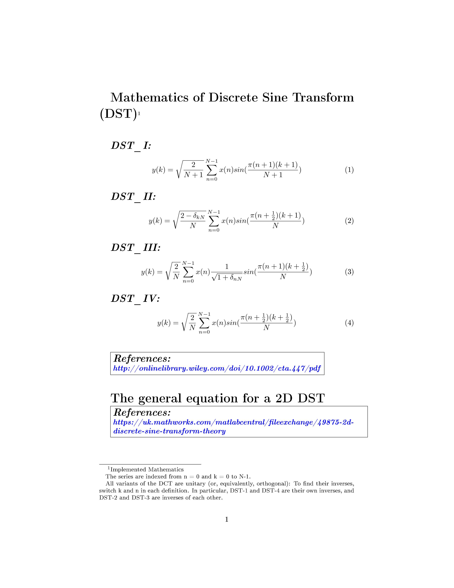
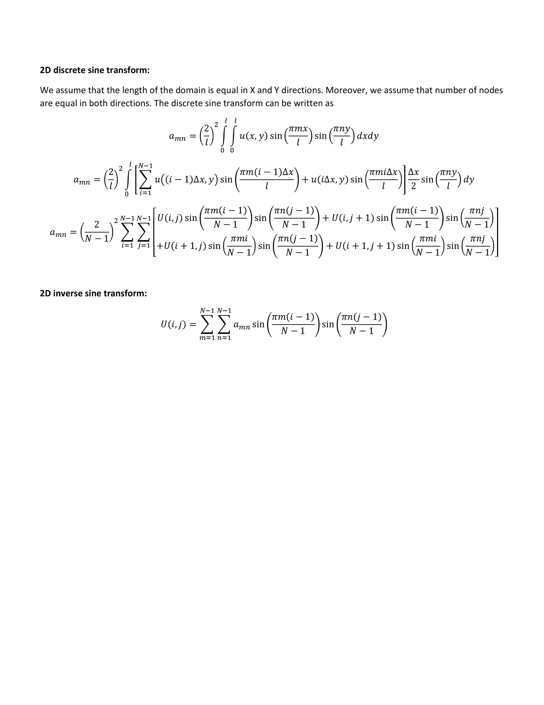
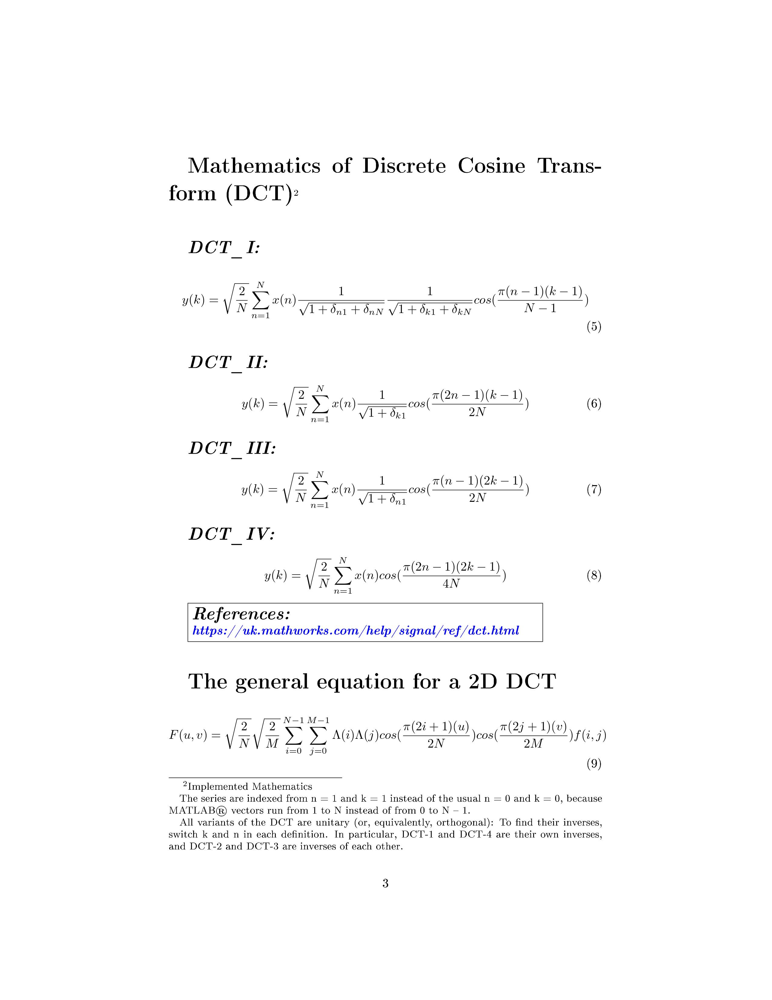
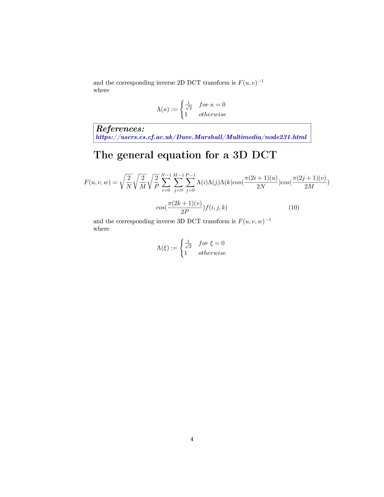

# DCT\_DST\_OnetoFour(double and single)-MATLAB\_CUDA\_MEX


# To compile:

First try the method described here:

[https://uk.mathworks.com/help/distcomp/run-mex-functions-containing-cuda-code.html](https://uk.mathworks.com/help/distcomp/run-mex-functions-containing-cuda-code.html)

After successful compiling, running and testing then simply try following statement (copy and paste in Matlab and enter):
```
>> debug_Discrete_Transform(false)

See the file “debug_Discrete_Transform.m” 


To compute Discrete Cosine/Sine Transform DCT/DST and inverse Discrete Cosine/Sine Transform IDCT/IDST user can choose/use the following unified syntax:
 
B=Discrete_Transform (Input array A, Type of Discrete Transform, Type of Transformation, Type of DCT/DST or IDCT/IDST, Dimensions)

Where

B: = output array same type as input array 

Input array A: = array, or gpuArray object

Type of Discrete Transform: = sine or cosine

Type of Transformation: = direct or inverse

Type of DCT/DST or IDCT/IDST: = one, two, three or four      (I, II, III, IV)

Dimensions: = row or column           (dimension to operate along)
```

<br>
 
""""""""""""""""""""""""""""""""""""""""""""""""""""""""""""""""""""""""""""""""""""""""""""""""""""""""""""""""""""""""""""""""""""""""
 
""""""""""""""""""""""""""""""""""""""""""""""""""""""""""""""""""""""""""""""""""""""""""""""""""""""""""""""""""""""""""""""""""""""""
 
""""""""""""""""""""""""""""""""""""""""""""""""""""""""""""""""""""""""""""""""""""""""""""""""""""""""""""""""""""""""""""""""""""""""
 
 </br>

